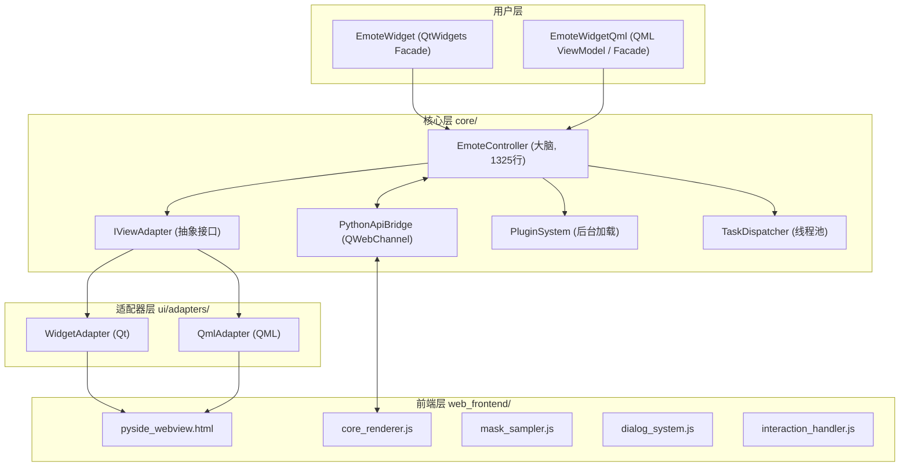
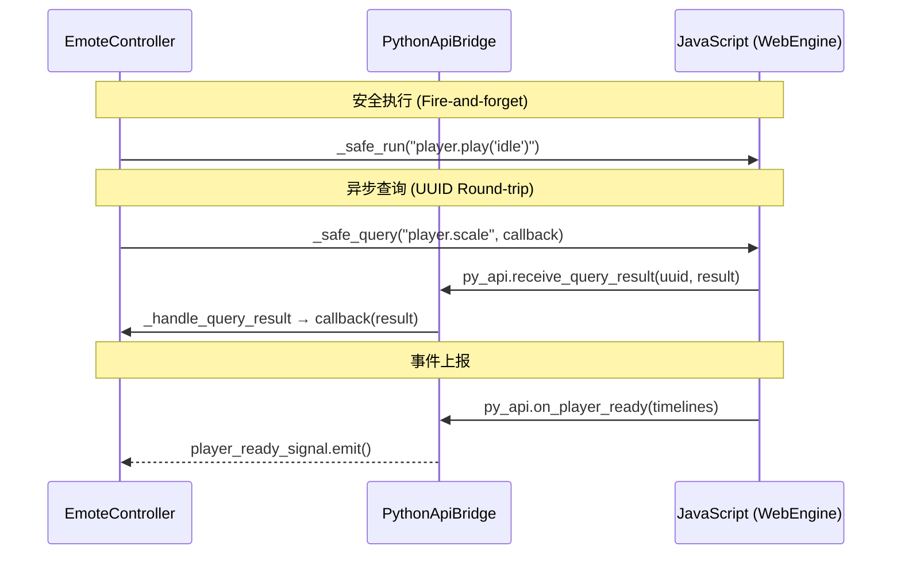

# EmoteWidget 项目全面审查分析

> **文档状态（2026-07）**：本文是重拾项目时的审查记录，记录了当前代码的结构、调用链和风险点。稳定的架构基线请看 [`docs/ARCHITECTURE.md`](docs/ARCHITECTURE.md)；本文中的行数、方法数量等统计均可能随代码变化而漂移。

## 项目概览

EmoteWidget 是一个基于 **PySide6** 构建的动态角色显示 SDK，用于加载和控制 [FreeMote (E-mote)](https://github.com/UlyssesWu/FreeMote) 模型。它采用 **Controller-Adapter 架构**，将核心业务逻辑与 UI 框架彻底解耦，支持 Qt Widgets 和 Qt Quick (QML) 两种前端，并允许通过插件扩展任意 GUI 框架。

**技术栈**: Python 3.10+ / PySide6 / JavaScript (WebEngine) / NumPy / SoundFile

---

## 架构分析

### 核心架构模式: Controller-Adapter（宽泛 MVVM）



### 核心模块职责

| 模块 | 文件 | 行数 | 职责 |
|------|------|------|------|
| **控制器** | [controller.py](file:///c:/Users/ti/Desktop/Python/Emotewidget_Final/emote_widget/core/controller.py) | 1325 | SDK 大脑，69 个方法，编排业务逻辑与状态管理 |
| **适配器接口** | [adapter_interface.py](file:///c:/Users/ti/Desktop/Python/Emotewidget_Final/emote_widget/core/adapter_interface.py) | 119 | [IViewAdapter](file:///c:/Users/ti/Desktop/Python/Emotewidget_Final/emote_widget/core/adapter_interface.py#12-119) ABC，定义 Controller↔UI 的契约 |
| **适配器注册表** | [adapter_registry.py](file:///c:/Users/ti/Desktop/Python/Emotewidget_Final/emote_widget/core/adapter_registry.py) | 83 | 装饰器注册 + 插件目录扫描 |
| **Python-JS 桥梁** | [python_api_bridge.py](file:///c:/Users/ti/Desktop/Python/Emotewidget_Final/emote_widget/core/python_api_bridge.py) | 135 | QWebChannel 通信枢纽 (JS `py_api` 对象) |
| **插件系统** | [plugin_system.py](file:///c:/Users/ti/Desktop/Python/Emotewidget_Final/emote_widget/core/plugin_system.py) | 237 | 后台线程扫描/加载插件 + PluginAccessor 语法糖 |
| **任务调度器** | [task_dispatcher.py](file:///c:/Users/ti/Desktop/Python/Emotewidget_Final/emote_widget/core/task_dispatcher.py) | 243 | 单例 QThreadPool + 节流器 + Worker 信号 |
| **协议处理器** | [scheme_handler.py](file:///c:/Users/ti/Desktop/Python/Emotewidget_Final/emote_widget/core/scheme_handler.py) | ~100 | 自定义 `emote://` 协议，安全沙箱资源加载 |
| **口型同步** | [lipsync_thread.py](file:///c:/Users/ti/Desktop/Python/Emotewidget_Final/emote_widget/core/lipsync_thread.py) | ~150 | 双指数移动平均 (Dual EMA) 的音频驱动口型 |

---

## 分层详解

### 1. 核心层 (`emote_widget/core/`)

#### EmoteController — 系统核心

`EmoteController` 是整个 SDK 的"大脑"，包含 **69 个方法**，覆盖:

- **生命周期管理**: `__init__`, `cleanup`, `on_page_load_finished`
- **JS 安全执行**: `_safe_run` (fire-and-forget), `_safe_query` (异步回环 UUID 匹配)
- **模型控制**: `load_model`, `play`, `set_coord`, `set_scale`, `set_rotation`, `auto_center`
- **差分动画**: `set_diff_timeline` (6 个槽位)
- **视觉特效**: `set_grayscale`, `set_global_alpha`, `set_vertex_color`, `set_background_color/image`
- **物理模拟**: `set_physics_scale`, `set_wind`
- **口型同步**: `start_lip_sync` (流模式), `start_lip_sync_from_file` (文件模式)
- **窗口控制**: `set_window_transparent`, `set_render_mask (click-through)`
- **资源管理**: `add_resource_path`, `list_available_resources`, `request_refresh_resources`
- **模型自省**: `_perform_introspection`, `find_param_by_usage`, `get/set_variable`
- **对话框**: `show_dialog` (气泡对话框 + 打字机效果)
- **交互**: `enable_drag`, `enable_zoom`, `enable_gaze_control`

> [!IMPORTANT]
> Controller 采用 **命令队列模式** — WebEngine 未就绪时，所有 JS 指令自动排队等待。通过 `_safe_query` 实现 Python→JS→(Bridge)→Python 的异步回环查询。

#### 通信机制



### 2. UI 层 (`emote_widget/ui/`)

#### 适配器实现

| 适配器 | 文件 | 关键技术 |
|--------|------|----------|
| **WidgetAdapter** | [qt_adapter.py](file:///c:/Users/ti/Desktop/Python/Emotewidget_Final/emote_widget/ui/adapters/qt_adapter.py) | `QWebChannel` 注册, `QRegion` 异形遮罩, `WA_TranslucentBackground` |
| **QmlAdapter** | [qml_adapter.py](file:///c:/Users/ti/Desktop/Python/Emotewidget_Final/emote_widget/ui/adapters/qml_adapter.py) | 延迟绑定, `QMetaObject.invokeMethod` 动态反射, QML 对象销毁监控 |

#### 视图封装 (Facade)

- [widget_qt.py](file:///c:/Users/ti/Desktop/Python/Emotewidget_Final/emote_widget/ui/views/widget_qt.py) — `EmoteWidget` (250 行): QWebEngineView + SchemeHandler + Adapter + Controller 的一站式封装。提供 `api` 属性代理和 `__getattr__` 动态转发。
- [widget_qml.py](file:///c:/Users/ti/Desktop/Python/Emotewidget_Final/emote_widget/ui/views/widget_qml.py) — `EmoteWidgetQml` (312 行): QObject 属性绑定 + 信号中继器 (`_SignalRelay`) + WebChannel 手动注册。

#### 调试组件

- `LipSyncMonitorWidget` — 音频振幅曲线 + 嘴型张开度实时可视化
- `MaskMonitorWidget` — 点击穿透区域 (红色矩形) 实时可视化

### 3. 前端层 (`emote_widget/web_frontend/`)

| JS 模块 | 行数 | 职责 |
|---------|------|------|
| [bridge_manager.js](file:///c:/Users/ti/Desktop/Python/Emotewidget_Final/emote_widget/web_frontend/js/bridge_manager.js) | ~80 | QWebChannel 初始化 + Promise 握手 |
| [core_renderer.js](file:///c:/Users/ti/Desktop/Python/Emotewidget_Final/emote_widget/web_frontend/js/core_renderer.js) | 250 | EmotePlayer 生命周期 + 画质控制 + AABB 自动居中 |
| [mask_sampler.js](file:///c:/Users/ti/Desktop/Python/Emotewidget_Final/emote_widget/web_frontend/js/mask_sampler.js) | 427 | Alpha 采样 + Greedy Meshing 矩形合并 + 二进制数据传输 |
| [dialog_system.js](file:///c:/Users/ti/Desktop/Python/Emotewidget_Final/emote_widget/web_frontend/js/dialog_system.js) | ~320 | 气泡对话框 + 打字机效果 + 主题加载 |
| [interaction_handler.js](file:///c:/Users/ti/Desktop/Python/Emotewidget_Final/emote_widget/web_frontend/js/interaction_handler.js) | ~240 | 拖拽/缩放/视线跟随 + 平滑插值 |

> [!NOTE]
> `mask_sampler.js` 是性能关键模块 — 使用 **Strict Directional Greedy Meshing** 算法将几千个像素点压缩为几十个矩形，`200ms` 采样周期，通过 `Int16Array` 二进制通道传输数据。

### 4. 工具层 (`emote_widget/utils/`)

| 模块 | 职责 |
|------|------|
| [paths.py](file:///c:/Users/ti/Desktop/Python/Emotewidget_Final/emote_widget/utils/paths.py) | 资源路径解析 + 安全白名单 + TTL 扫描缓存 + `emote://` URL 转换 |
| [bound_params.py](file:///c:/Users/ti/Desktop/Python/Emotewidget_Final/emote_widget/utils/bound_params.py) | 模型变量语义映射 (BoundMap) + 缓存序列化 |
| [controller_proxy.py](file:///c:/Users/ti/Desktop/Python/Emotewidget_Final/emote_widget/utils/controller_proxy.py) | `SandboxProxy` 安全代理 + `PoisonPillProxy` |
| [audio_utils.py](file:///c:/Users/ti/Desktop/Python/Emotewidget_Final/emote_widget/utils/audio_utils.py) | 音频文件→流式队列转换 |
| [logger.py](file:///c:/Users/ti/Desktop/Python/Emotewidget_Final/emote_widget/utils/logger.py) | 分模块日志器 (widget/adapter/plugin/file/worker) |

### 5. 插件系统 (`plugins/`)

#### behavior_engine (行为引擎)
- [main.py](file:///c:/Users/ti/Desktop/Python/Emotewidget_Final/plugins/behavior_engine/main.py) (347 行): 基于 **情感空间游走 (Emotional Walker)** 的自主行为引擎
  - Valence-Arousal 二维情感坐标系
  - Perlin Noise 驱动的渐进式情感漂移
  - 基于情感阈值的动作决策 (点头/摇头/开心/惊讶/害羞/生气...)
  - 点击/悬停事件产生情感冲量

#### example（插件系统示例）
- [main.py](file:///c:/Users/ti/Desktop/Python/Emotewidget_Final/plugins/example/main.py)：示范生命周期、Controller 信号、EventBus、Middleware 与 Qt UI，并明确说明不建议使用猴子补丁

### 6. 测试平台 (`testers/test_qt.py` / `testers/test_qml.py`)

[testers/test_qt.py](file:///c:/Users/ti/Desktop/Python/Emotewidget_Final/testers/test_qt.py) — Qt Widgets 全功能测试平台 `TestMainWindow`；[testers/test_qml.py](file:///c:/Users/ti/Desktop/Python/Emotewidget_Final/testers/test_qml.py) — QML 测试入口：

- **DebugConsole**: 嵌入式 Python 控制台 + 自动补全弹窗
- **CheckableComboBox**: 多选下拉框 (差分动画选择)
- **ParamControlWidget**: 每个模型变量的滑块/范围/分类/用途标签控件
- **8 个标签页**: 基础控制 / 变换 / 动画 / 外观 / 物理 / 高级 / 参数绑定 / 插件 / 终端
- QML 测试界面资源位于 `qml_tester/qml/`，后端上下文对象名为 `EmoteBackend`。

---

## 设计亮点总结

1. **`emote://` 安全沙箱协议** — 免关 CORS，白名单路径校验，防路径穿越
2. **Promise 握手 + UUID 回环** — 杜绝 JS-Python 通信时序 Race Condition
3. **命令队列模式** — WebEngine 未就绪时指令自动排队
4. **Greedy Meshing + Int16 二进制传输** — mask_sampler 高性能点击穿透
5. **Emotional Walker** — 基于 Perlin Noise 的自主行为引擎，使角色看起来"有生命"
6. **双 EMA 口型同步** — 平滑且自然的音频驱动嘴部动画
7. **Facade + Adapter + Factory** — 多重设计模式保证架构可扩展性

---

## 当前入口与文档使用顺序

当前仓库没有 `run_tests.py`。实际入口是：

```text
Qt Widgets：python testers/test_qt.py
QML：       python testers/test_qml.py
穿透专项：  python testers/click_through_test.py
SDK Qt：    from emote_widget import EmoteWidget
SDK QML：   from emote_widget import EmoteWidgetQml
```

建议阅读顺序：

1. `docs/ARCHITECTURE.md`：当前架构基线。
2. 本文：重构审查、设计亮点和风险记录。
3. `emote_widget/core/controller.py`：核心业务编排。
4. `emote_widget/ui/views/` 与 `ui/adapters/`：两条 UI 路径。
5. `testers/test_qt.py`、`testers/test_qml.py`：实际使用方式。

## 文件统计

| 层级 | Python 文件 | JS 文件 | 总代码行 (估算) |
|------|------------|---------|----------------|
| core/ | 8 | 0 | ~2,800 |
| ui/ | 4 | 0 | ~900 |
| utils/ | 5 | 0 | ~700 |
| web_frontend/ | 0 | 5 | ~1,300 |
| plugins/ | 4 | 0 | ~600 |
| 测试/入口 | 2 | 0 | ~1,200 |
| **合计** | **23** | **5** | **~7,500** |
